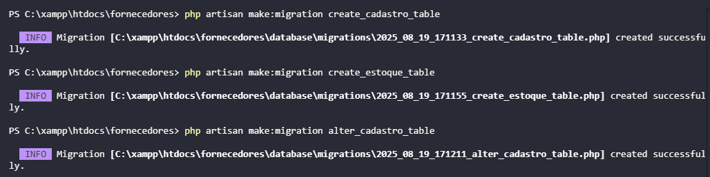
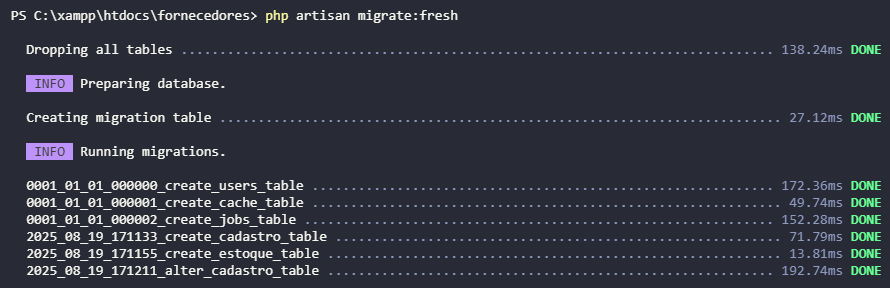

# Projeto Laravel - Fornecedores

Projeto em PHP com uso do Laravel para gerenciar tabelas e registros do banco de dados, e executar migrations de criação e alteração

---

## 📌 Requisitos para execução

Antes de iniciar, certifique-se de ter os seguintes softwares instalados no seu ambiente:

- **PHP** (>= 8.0)
- **Composer** (gerenciador de dependências PHP)
- **MySQL** (instalado e rodando)
- **VS Code** ou outro editor de código

---

## 🚀 Tutorial

### 1️⃣ Instalação do Laravel

No terminal, execute o comando:

```bash
laravel new fornecedores
```

---

### 2️⃣ Configuração do banco de dados

Edite o arquivo `.env` na raiz do projeto e configure as credenciais do seu banco MySQL:

```env
DB_CONNECTION=mysql
DB_HOST=127.0.0.1
DB_PORT=3306
DB_DATABASE=fornecedores
DB_USERNAME=root
DB_PASSWORD=
```

> ⚠️ Substitua os valores de `DB_DATABASE`, `DB_USERNAME` e `DB_PASSWORD` conforme o seu ambiente.

---

### 3️⃣ Criando as migrations

Dentro da pasta do projeto, execute:

```bash
php artisan make:migration create_fornecedores_table
php artisan make:migration create_cadastro_table
php artisan make:migration alter_fornecedores_table
```

📷 **Print da criação das migrations:**


No arquivos gerado em `database/migrations/`, adicione os campos desejados:

```php
// create_fornecedores_table
public function up(): void
{
    Schema::create('cadastro', function (Blueprint $table) {
            $table->id();
            $table->string('nome');
            $table->string('endereco');
            $table->string('telefone');
            $table->string('cnpj')->unique();
            $table->timestamps();
        });
}
```

```php
// create_estoque_table
public function up(): void
{
    Schema::create('estoque', function (Blueprint $table) {
            $table->id();
            $table->integer('quantidade');
            $table->double('valor_unitario');
            $table->timestamps();
        });
}
```

```php
// alter_fornecedores_table
public function up(): void
{
    Schema::table('cadastro', function (Blueprint $table) {
            $table->string('razao_social')->unique();
            $table->string('nome_fantasia')->unique();
        });
}
```

---

### 4️⃣ Rodando as migrations

Execute no terminal:

```bash
php artisan migrate:fresh
```

📷 **Print da execução das migrations:**



---

## 🗄 Arquivo SQL do banco de dados

O arquivo `fornecedores.sql` contém o script para criação da tabela diretamente no MySQL:

---

## 🔗 Versionamento

O código completo está disponível no GitHub:

📌 **Repositório:** [https://github.com/ferreiraluizga/laravel-alter-migrations](https://github.com/ferreiraluizga/laravel-alter-migrations)

---